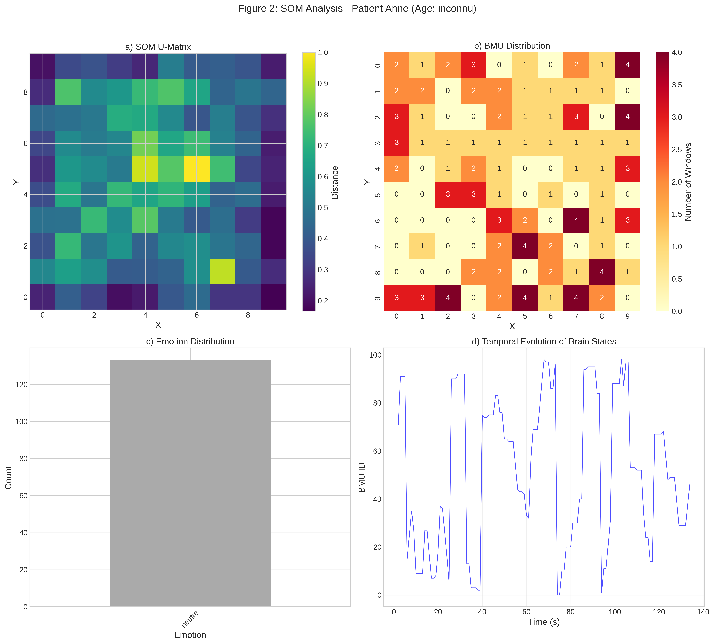
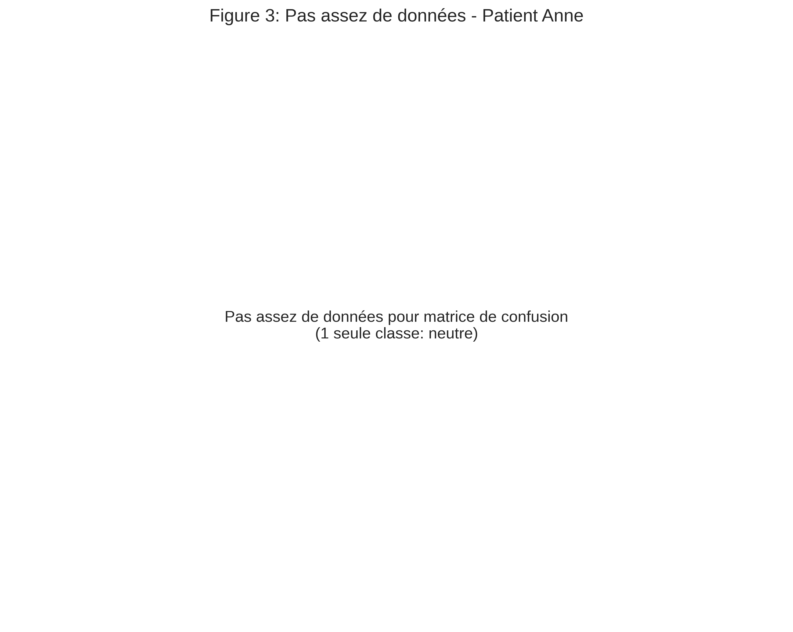
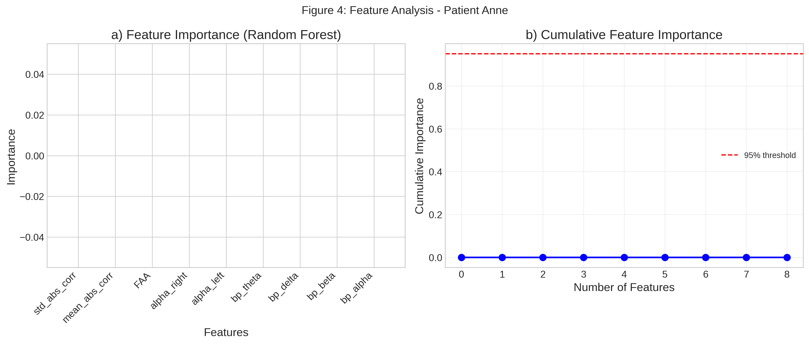
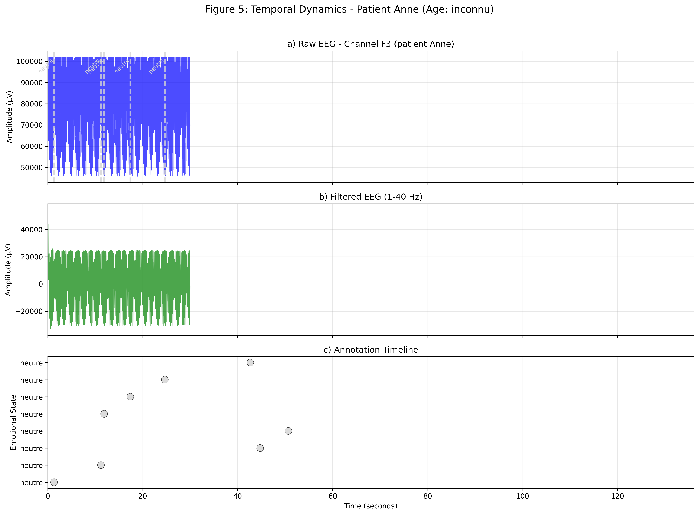
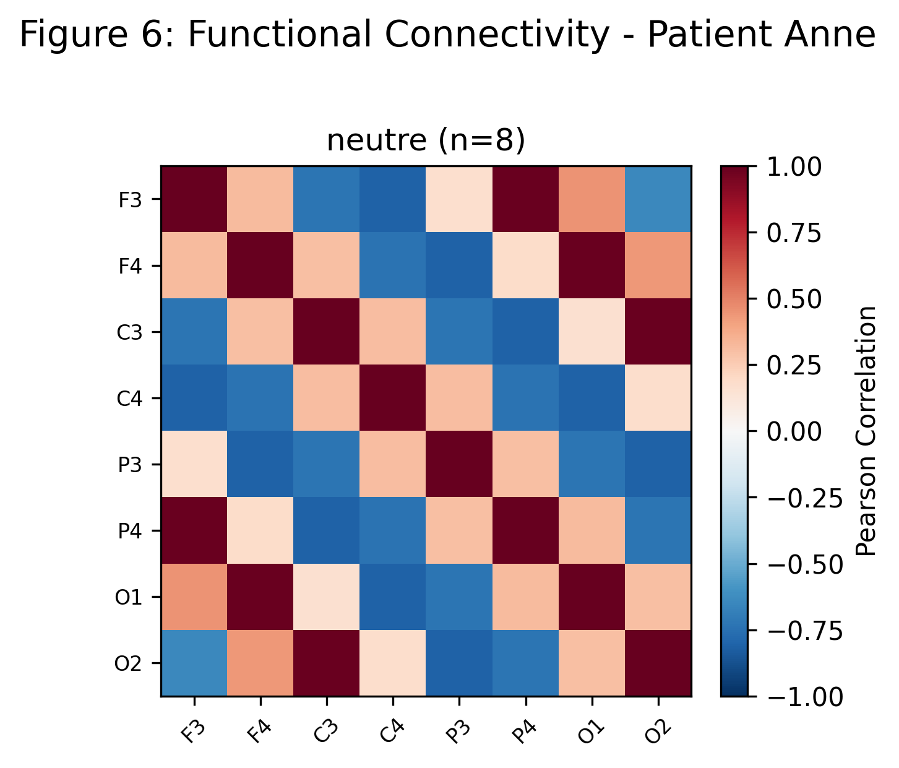
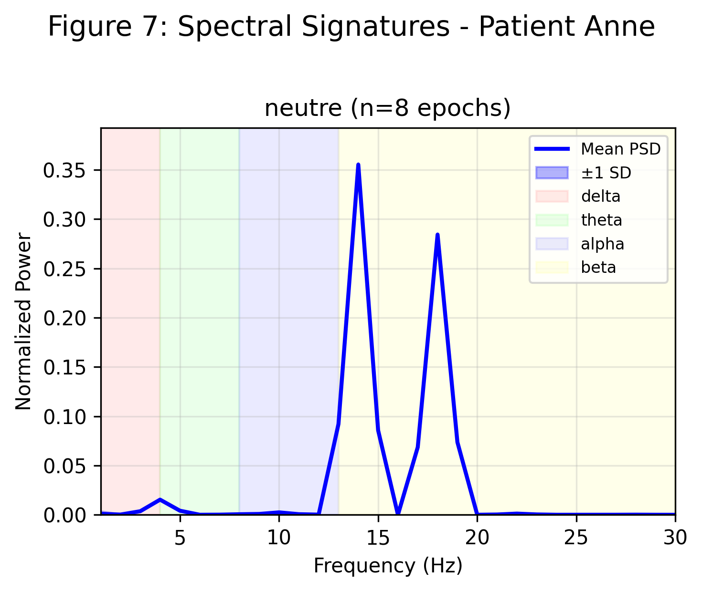

# README.md - Projet de Détection d'Émotions par EEG Patient-Spécifique

```markdown
# 🧠 Patient-Specific EEG-Based Emotion Detection

## Interface de Communication Augmentée pour Patients Polyhandicapés avec Aphasie

[](https://www.python.org/downloads/)
[](https://streamlit.io/)
[](https://opensource.org/licenses/MIT)

---

## 📋 Table des Matières
- [Contexte & Objectifs](#-contexte--objectifs)
- [Architecture du Projet](#-architecture-du-projet)
- [Installation](#-installation)
- [Pipeline Complet](#-pipeline-complet)
- [Applications d'Inférence Temps Réel](#-applications-dinférence-temps-réel)
- [Structure des Données](#-structure-des-données)
- [Utilisation](#-utilisation)
- [Résultats & Visualisations](#-résultats--visualisations)
- [Publication Scientifique](#-publication-scientifique)
- [Dépannage](#-dépannage)
- [Roadmap](#-roadmap)
- [Licence & Contact](#-licence--contact)

---

## 🎯 Contexte & Objectifs

Ce projet vise à **restaurer une capacité de communication** pour des personnes en situation de **polyhandicap avec aphasie** en utilisant l'électroencéphalographie (EEG). L'objectif est de détecter en temps réel les états émotionnels et les besoins fondamentaux du patient pour permettre une communication non-verbale.

### 👥 Population Cible
- Patients polyhandicapés
- Personnes avec aphasie sévère
- Personnes ne pouvant pas utiliser d'interfaces tactiles classiques

### 🎯 Émotions/Besoins Détectés
| Émotion/Besoin | Émoji | Description |
|---------------|-------|-------------|
| 😊 Joie | 😊 | Content, heureux |
| 😌 Sérénité | 😌 | Calme, apaisé |
| 😨 Peur | 😨 | Anxiété, peur |
| 😠 Colère | 😠 | Irrité, frustré |
| 🤩 Excitation | 🤩 | Excité, enthousiaste |
| 😖 Douleur | 😖 | Inconfort, douleur |
| 🍽️ Faim | 🍽️ | Besoin de nourriture |
| 💧 Soif | 💧 | Besoin de boire |
| 🤔 Envie | 🤔 | Désir, demande |
| 😴 Fatigue | 😴 | Sommeil, épuisement |
| 😐 Neutre | 😐 | État de base |
| 🗣️ Parle | 🗣️ | Désir de communiquer |

---

## 🏗️ Architecture du Projet

```
Patient-Specific-EEG-Based-Emotion-Detection/
│
├── 📁 **Scripts Principaux**
│   ├── 01_acquisition.py        # Acquisition EEG temps réel
│   ├── 02_tagging_app.py         # Interface d'annotation (Streamlit)
│   ├── 03_som_pipeline.py         # Extraction features + SOM
│   ├── 04_build_labels.py          # Construction des labels
│   ├── 05_train_model.py            # Entraînement modèle patient-spécifique
│   ├── 06_analyze_results.py         # Génération figures papier
│   ├── 07_advanced_analysis.py        # Analyses avancées (connectivité, spectral)
│   ├── 08_inference_app.py             # App d'inférence stable pour patients
│   └── 09_simple_inference.py           # Version simplifiée pour tests
│
├── 📁 **Utilitaires**
│   ├── config.py                   # Configuration centralisée
│   ├── eeg_utils.py                 # Traitement du signal EEG
│   ├── file_utils.py                  # Gestion fichiers et compatibilité
│   └── run_pipeline.py                  # Pipeline automatisé
│
├── 📁 **SDK Bitbrain**
│   └── bbt-sdk_2.8.6-ubuntu-22.04/     # SDK du casque EEG Air
│
├── 📁 **Données**
│   └── data/
│       ├── .current_session.json        # Session courante
│       └── patients/
│           ├── patient_Anne/            # Dossier patient Anne
│           │   ├── eeg_*.csv            # Sessions EEG
│           │   └── annotations.csv       # Annotations associées
│           └── patient_Anne-prod/        # Second patient
│
├── 📁 **Sorties & Modèles**
│   ├── outputs/                         # Résultats d'analyse
│   │   ├── patient_Anne/                 # Par patient
│   │   │   ├── som_features.csv
│   │   │   ├── som_clusters.csv
│   │   │   ├── som_clusters_annotated.csv
│   │   │   └── advanced_stats_*.txt
│   │   └── patient_Anne-prod/
│   │
│   ├── models/                           # Modèles entraînés
│   │   ├── patient_Anne/
│   │   │   ├── patient_model_rf.joblib
│   │   │   ├── feature_scaler.joblib
│   │   │   └── model_metrics.txt
│   │   └── patient_Anne-prod/
│   │
│   └── figures/                           # Visualisations
│       ├── figure1_pipeline.png            # Figure générale
│       ├── patient_Anne/                    # Figures par patient
│       │   ├── figure2_som_Anne.png
│       │   ├── figure3_confusion_Anne.png
│       │   ├── figure4_features_Anne.png
│       │   ├── figure5_timeline_Anne.png
│       │   ├── figure6_connectivity_Anne.png
│       │   └── figure7_spectral_Anne.png
│       └── patient_Anne-prod/
│
├── 📁 **Publication**
│   └── paper/                            # Sources LaTeX pour article
│       ├── main.tex
│       ├── sections/
│       ├── figures/                       # Figures pour l'article
│       └── bibliography/
│
├── 📁 **Scripts Auxiliaires**
│   ├── copy_figures_to_paper.py           # Copie figures vers dossier paper
│   ├── migrate_all.py                      # Migration anciennes données
│   ├── run_inference.sh                     # Lancement app inférence
│   └── setup.sh                              # Installation automatique
│
├── requirements.txt                        # Dépendances Python
└── README.md                               # Cette documentation
```

---

## 🔧 Installation

### Prérequis
- Python 3.9 ou supérieur
- Casque EEG Bitbrain Air avec SDK
- 8 Go RAM minimum
- Tablette/Smartphone pour l'interface patient (optionnel)

### 1. Cloner le dépôt
```bash
git clone https://github.com/votre-repo/Patient-Specific-EEG-Based-Emotion-Detection.git
cd Patient-Specific-EEG-Based-Emotion-Detection
```

### 2. Installer les dépendances
```bash
# Créer un environnement virtuel (recommandé)
python -m venv eeg_env
source eeg_env/bin/activate  # Linux/Mac
# ou .\eeg_env\Scripts\activate  # Windows

# Installer les packages
pip install -r requirements.txt
```

### 3. Configuration du SDK Bitbrain
```bash
# Vérifier que les binaires sont exécutables
chmod +x bbt-sdk_2.8.6-ubuntu-22.04/sdk_linux_2.8.6/sdk/2.8.6/bin/*
```

### 4. Vérification
```bash
python -c "import numpy, pandas, streamlit, sklearn; print('✅ OK')"
```

---

## 🚀 Pipeline Complet

### 1️⃣ Acquisition EEG (`01_acquisition.py`)
```bash
python 01_acquisition.py
```
- Interface ligne de commande pour l'acquisition
- Sélection ou création du patient
- Monitoring en temps réel (impédances, batterie)
- Sauvegarde automatique dans `data/patients/patient_NOM/`

### 2️⃣ Annotation des Émotions (`02_tagging_app.py`)
```bash
streamlit run 02_tagging_app.py
```
- Interface tactile pour soignants
- Synchronisation automatique avec l'EEG
- Export des annotations par patient

### 3️⃣ Analyse SOM (`03_som_pipeline.py`)
```bash
python 03_som_pipeline.py
```
- Extraction des features (bandes de fréquence, asymétrie, connectivité)
- Clustering par Self-Organizing Map (10×10)
- Visualisation des états cérébraux

### 4️⃣ Construction des Labels (`04_build_labels.py`)
```bash
python 04_build_labels.py
```
- Association annotations ↔ fenêtres EEG
- Création du dataset labellisé

### 5️⃣ Entraînement du Modèle (`05_train_model.py`)
```bash
python 05_train_model.py
```
- Random Forest patient-spécifique
- Cross-validation et métriques
- Sauvegarde du modèle dans `models/patient_NOM/`

### 6️⃣ Analyses Avancées (`06_analyze_results.py` & `07_advanced_analysis.py`)
```bash
python 06_analyze_results.py      # Figures pour papier
python 07_advanced_analysis.py     # Connectivité et analyses spectrales
```

---

## 🎮 Applications d'Inférence Temps Réel

### Version Stable pour Patients (`08_inference_app.py`)
```bash
./run_inference.sh  # ou streamlit run 08_inference_app.py
```

**Caractéristiques** :
- ✅ **Lissage temporel** : Évite les changements trop rapides
- ✅ **Paramètres ajustables** : Mémoire, seuil, temps de maintien
- ✅ **Interface adaptée** : Émojis géants, couleurs contrastées
- ✅ **Mode patient** : Interface simplifiée, 3-4 éléments max
- ✅ **Historique** : Trace des dernières émotions

**Réglages disponibles** :
| Paramètre | Description | Valeur par défaut |
|-----------|-------------|-------------------|
| Taille mémoire | Nb de mesures à mémoriser | 5 |
| Seuil stabilité | % requis pour changer | 40% |
| Temps minimum | Durée min d'affichage | 0.5s |

### Version Simple (`09_simple_inference.py`)
```bash
streamlit run 09_simple_inference.py
```
Version ultra-simplifiée pour tests et démonstration.

### Accès depuis tablette
```bash
# Lancer avec adresse réseau
streamlit run 08_inference_app.py --server.address 0.0.0.0 --server.port 8501
```
Puis sur la tablette : `http://[IP-DU-PC]:8501`

---

## 📁 Structure des Données

### Organisation par Patient
```
data/patients/
├── patient_Anne/
│   ├── eeg_resting_state_20260304_185447.csv    # Session repos
│   ├── eeg_stimulation_20260305_091234.csv      # Session stimulation
│   └── annotations.csv                           # Toutes les annotations
│
└── patient_Anne-prod/
    ├── eeg_task_20260304_212554.csv              # Session tâche
    └── annotations.csv
```

### Format des Fichiers EEG
```csv
time_s,ch1,ch2,ch3,ch4,ch5,ch6,ch7,ch8
0.000,12.34,11.56,13.21,...
0.004,12.45,11.67,13.34,...
...
```

### Format des Annotations
```csv
time_s,label,session_id,eeg_file,notes
10.5,joie,20260304_185447,eeg_resting_state_20260304_185447.csv,"patient calme"
```

---

## 📊 Résultats & Visualisations

### Figures Générées Automatiquement

#### Figure 1: Pipeline Complet

*Vue d'ensemble du pipeline de traitement*

#### Figure 2: Analyse SOM

*a) U-Matrix • b) Distribution BMU • c) Distribution émotions • d) Évolution temporelle*

#### Figure 3: Matrice de Confusion

*Performance du modèle patient-spécifique*

#### Figure 4: Importance des Features

*Features les plus importantes pour la classification*

#### Figure 5: Timeline Temporelle

*Évolution du signal EEG et des annotations*

#### Figure 6: Connectivité Fonctionnelle

*Matrices de corrélation par état émotionnel*

#### Figure 7: Analyse Spectrale

*Densité spectrale par émotion*

---

## 📈 Publication Scientifique

### Structure du Papier
Le dossier `paper/` contient les sources LaTeX pour l'article scientifique :

```
paper/
├── main.tex                          # Document principal
├── preamble.tex                       # Packages et configuration
├── Makefile                            # Compilation automatique
├── compile_final.sh                     # Script de compilation
│
├── sections/                            # Chapitres
│   ├── 00_abstract.tex
│   ├── 01_introduction.tex
│   ├── 02_methods.tex
│   ├── 03_results.tex
│   ├── 04_discussion.tex
│   ├── 05_conclusion.tex
│   └── 06_acknowledgments.tex
│
├── figures/                             # Figures pour l'article
│   ├── figure1_pipeline.png
│   ├── figure2_som_P001.png
│   ├── figure3_confusion_P001.png
│   └── ...
│
└── bibliography/                        # Références
    └── references.bib
```

### Compilation du Papier
```bash
cd paper
make           # ou ./compile_final.sh
```
Le PDF sera généré dans `paper/build/main.pdf`

### Métriques Clés
Le script `06_analyze_results.py` génère automatiquement :
- **Tableau des patients** : âge, sexe, condition
- **Métriques de performance** : accuracy, precision, recall, F1
- **Matrices de confusion** par patient
- **Importance des features** pour interprétabilité

---

## 🛠️ Dépannage

### Problèmes Courants

| Problème | Solution |
|----------|----------|
| `Permission denied` pour bthserver | `chmod +x bbt-sdk_2.8.6-ubuntu-22.04/sdk_linux_2.8.6/sdk/2.8.6/bin/*` |
| Module `minisom` non trouvé | `pip install minisom` |
| Fichiers dans mauvais dossier | `python migrate_all.py` |
| Streamlit ne s'affiche pas | Vérifier le firewall : `sudo ufw allow 8501` |
| Interface trop rapide | Utiliser `08_inference_app.py` en mode stable |

### Logs et Debug
```bash
# Voir les logs en temps réel
streamlit run 08_inference_app.py --logger.level=debug

# Tester l'acquisition sans casque
python -c "from eeg_utils import *; print('✅ Module chargé')"
```

---

## 🗺️ Roadmap

### Version 1.0 (Actuelle) ✅
- [x] Acquisition EEG temps réel
- [x] Interface d'annotation Streamlit
- [x] Pipeline SOM complet
- [x] Modèles patient-spécifiques
- [x] Application d'inférence stable
- [x] Génération figures papier

### Version 1.1 (Prévue)
- [ ] Synthèse vocale des émotions
- [ ] Mode urgence (bouton rouge)
- [ ] Export PDF des rapports
- [ ] Multi-langues (FR/EN)

### Version 2.0 (Futur)
- [ ] Apprentissage continu
- [ ] Interface VR pour stimulation
- [ ] Télésurveillance
- [ ] Application mobile native

---

## 📄 Licence & Contact

### Licence
Ce projet est sous licence **GNU General Public License v3.0** - voir le fichier [LICENSE](LICENSE) pour plus de détails.

#### Ce que cette licence permet :
- ✅ **Utilisation commerciale** : Vous pouvez utiliser ce projet dans un contexte commercial
- ✅ **Modification** : Vous pouvez modifier le code pour l'adapter à vos besoins
- ✅ **Distribution** : Vous pouvez redistribuer le code original ou modifié
- ✅ **Garantie** : Le code est fourni sans garantie (comme indiqué dans la licence)
- ✅ **Brevet** : Une autorisation explicite d'utilisation des brevets est accordée

#### Conditions :
- 📢 **Disclosure** : Vous devez rendre public le code source de vos modifications
- ⚖️ **Même licence** : Toute redistribution doit se faire sous GPLv3
- 📝 **Copyright** : Vous devez préserver les mentions de copyright originales
- 📄 **Changelog** : Les modifications doivent être documentées

#### Compatibilité :
- ✅ Compatible avec les projets open source sous licence GPL
- ⚠️ **Non compatible** avec les projets sous licence propriétaire ou MIT/BSD (sans clauses spéciales)

#### Citation pour logiciel sous GPLv3 :
```bibtex
@software{mealier2025eeg,
  author = {Mealier, Anne-Laure},
  title = {Patient-Specific EEG-Based Emotion Detection},
  year = {2025},
  license = {GPL-3.0},
  url = {https://github.com/AnneLaureM/Patient-Specific-EEG-Based-Emotion-Detection}
}

### Contact
**Anne-Laure Mealier**
- 📧 Email: anne-laure.mealier@centrale-med.fr
- 💻 GitHub: [AnneLaureM](https://github.com/AnneLaureM)

### Citation
Si vous utilisez ce projet dans vos recherches :

```bibtex
@software{mealier2025eeg,
  author = {Mealier, Anne-Laure},
  title = {Patient-Specific EEG-Based Emotion Detection},
  year = {2025},
  url = {https://github.com/AnneLaureM/Patient-Specific-EEG-Based-Emotion-Detection}
}
```

---

## 🙏 Remerciements

- **Bitbrain** pour le SDK et le support technique
- **Centrale Méditerranée** pour le financement
- Les **patients et soignants** pour leur participation

---

<div align="center">
  <strong>🧠 Donner une voix à ceux qui ne peuvent pas parler</strong>
  <br><br>
  
  <br>
  <em>Analyse spectrale des émotions - Patient Anne</em>
</div>

---

*Dernière mise à jour : Mars 2025*
```